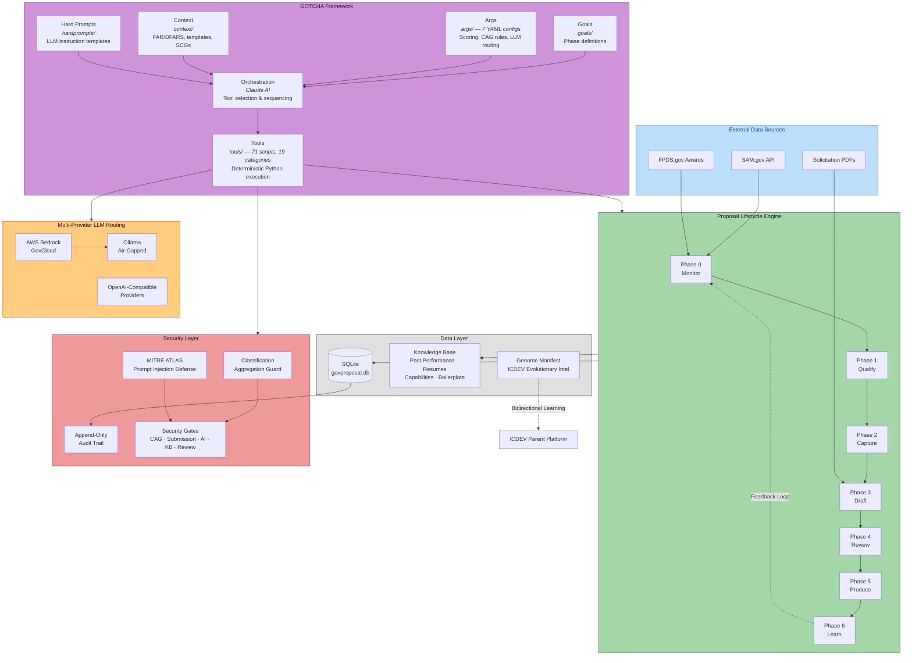
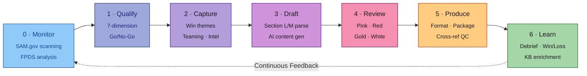
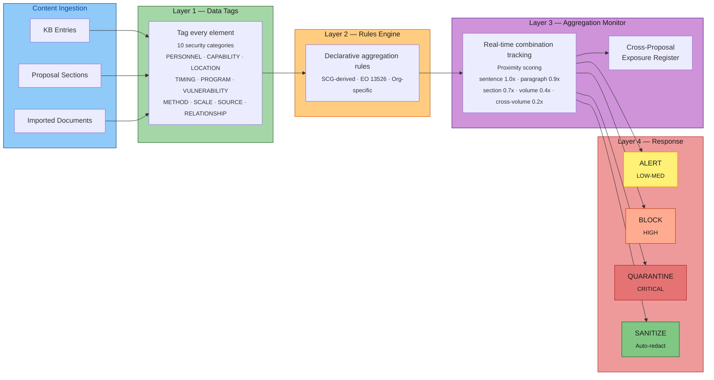
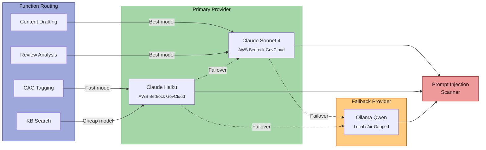
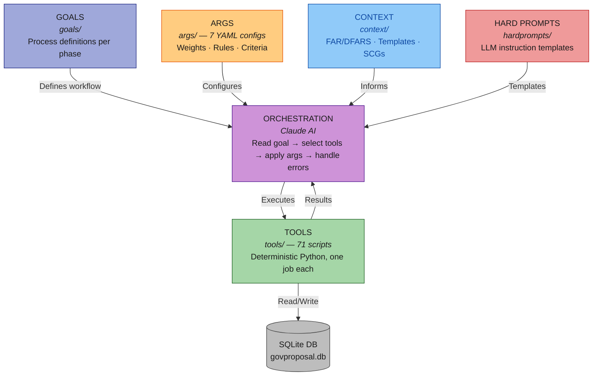

# GovProposal — AI-Native Government Proposal & RFP Response Portal

**Built with [ICDEV](https://github.com/anthropics/icdev) (Intelligent Coding Development Platform)**

GovProposal is a full-lifecycle proposal management system for DoD/IC IT Services,
generated and maintained using ICDEV's AI-driven development pipeline. It automates
the complete [Shipley](https://www.shipleywins.com/) capture-to-submission workflow —
from opportunity monitoring on SAM.gov through post-award learning — with built-in
classification security, compliance enforcement, and multi-provider LLM routing.

**Target Niche:** DoD/IC IT Services (NAICS 541512, 541519, 541330)

---

## Built with ICDEV

GovProposal was created using **ICDEV** — an AI-powered platform that builds complete,
compliance-ready applications from plain-English descriptions. ICDEV generated the
entire application through its deterministic pipeline:

- **GOTCHA Framework** — GovProposal inherits ICDEV's 6-layer architecture
  (Goals, Orchestration, Tools, Context, Hard Prompts, Args) for deterministic,
  auditable AI-assisted workflows
- **71 deterministic tools** across 19 specialized categories, each generated by
  ICDEV's Builder agent
- **7 YAML configuration files** governing scoring weights, CAG rules, review
  criteria, LLM routing, cloud configuration, and security gates
- **Compliance-ready** — ICDEV's Compliance agent mapped security controls and
  generated audit infrastructure aligned with NIST 800-171, EO 13526, FAR 3.104,
  and DFARS 204.73
- **Evolutionary Intelligence** — GovProposal tracks its capability genome for
  parent-child lifecycle management with ICDEV, enabling bidirectional learning
  between the generated application and the platform that created it

To learn more about ICDEV, visit the [ICDEV repository](https://github.com/anthropics/icdev).

---

## System Architecture



---

## Key Features

### 7-Phase Proposal Lifecycle



| Phase | What It Does |
|-------|-------------|
| **0 — Opportunity Intelligence** | SAM.gov API polling, FPDS award analysis, NAICS auto-classification, opportunity-company fit scoring (0–100) |
| **1 — Qualification** | 7-dimension weighted Go/No-Go scoring across customer relationship, technical fit, past performance, competitive position, vehicle access, clearance compliance, and strategic value |
| **2 — Capture Management** | Win theme generation, teaming engine, customer intelligence, black hat (competitor) review, price-to-win estimation from FPDS historical data |
| **3 — Content Generation** | Section L/M parsing, compliance matrix auto-generation, RAG retrieval from knowledge base, AI-drafted proposal sections across all volumes |
| **4 — Review Cycles** | Pink (compliance), Red (responsiveness), Gold (win themes), and White (final QC) team reviews |
| **5 — Production** | Template-based document assembly, auto-formatting, cross-reference validation, acronym management, submission packaging |
| **6 — Post-Submission Learning** | Debrief capture, win/loss pattern analysis, knowledge base enrichment, pricing calibration |

### Classification Aggregation Guard (CAG)

The CAG is GovProposal's critical security feature. It prevents the **mosaic effect** — when
individually unclassified data elements combine to create classified information
(EO 13526 Section 1.7(e), DoDM 5200.01).



- **10 Security Categories:** Personnel, Capability, Location, Timing, Program,
  Vulnerability, Method, Scale, Source, Relationship
- **Proximity Scoring:** Same sentence (1.0x) through cross-volume (0.2x)
- **Cross-Proposal Tracking:** Cumulative exposure register detects compilation risk
  across all proposals
- **Graduated Response:** Alert → Block → Quarantine → Sanitize with automated
  redaction suggestions

### AI Security (MITRE ATLAS)

- 5-category prompt injection detection (role hijacking, delimiter attacks,
  instruction injection, data exfiltration, encoded payloads)
- AI telemetry with SHA-256 prompt/response hashing for privacy-preserving audit
- AI Bill of Materials (BOM) generation cataloging all AI/ML components

### Multi-Provider LLM Routing

Cloud-agnostic architecture with automatic failover:



Supports AWS GovCloud (primary), Ollama for air-gapped environments, and
OpenAI-compatible providers.

---

## Architecture — GOTCHA Framework

GovProposal follows ICDEV's GOTCHA framework for deterministic, auditable AI workflows:



| Layer | Directory | Role |
|-------|-----------|------|
| **Goals** | `goals/` | Process definitions for each proposal lifecycle phase |
| **Orchestration** | *(Claude)* | Reads goal, decides tool order, applies args, handles errors |
| **Tools** | `tools/` | 71 deterministic Python scripts across 19 categories |
| **Args** | `args/` | 7 YAML config files (scoring, CAG rules, review criteria, LLM routing) |
| **Context** | `context/` | FAR/DFARS references, proposal templates, SCGs, NAICS codes |
| **Hard Prompts** | `hardprompts/` | LLM templates for drafting, reviewing, analyzing |

### Tool Categories

| Category | Purpose |
|----------|---------|
| `tools/monitor/` | SAM.gov scanning, opportunity scoring, pipeline management |
| `tools/capture/` | Win themes, teaming, customer intel, black hat review |
| `tools/proposal/` | Section parsing, compliance matrix, content drafting, assembly |
| `tools/review/` | Pink, Red, Gold, and White team reviews |
| `tools/production/` | Templates, formatting, cross-references, submission packaging |
| `tools/learning/` | Debriefs, win/loss analysis, pricing calibration |
| `tools/knowledge/` | Knowledge base, past performance, resume management |
| `tools/cag/` | Data tagging, rules engine, aggregation monitor, exposure register |
| `tools/competitive/` | FPDS analysis, competitor tracking, price-to-win |
| `tools/security/` | Prompt injection detection, AI telemetry, AI BOM |
| `tools/llm/` | Multi-provider LLM router with fallback chains |
| `tools/dashboard/` | Web-based monitoring dashboard |
| `tools/db/` | Database initialization and management |
| `tools/crm/` | Customer relationship management integration |
| `tools/erp/` | Enterprise resource planning integration |
| `tools/rfx/` | RFx document processing |
| `tools/mcp/` | Model Context Protocol integration |
| `tools/compat/` | Compatibility utilities |
| `tools/scripts/` | Utility scripts |

---

## Quick Start

### Prerequisites

- Python 3.11+
- SQLite 3 (bundled with Python)
- (Optional) AWS credentials for Bedrock LLM access
- (Optional) Ollama for local/air-gapped LLM inference

### Installation

```bash
# Clone the repository
git clone <repository-url>
cd GovProposal

# Install dependencies
pip install -r requirements.txt

# Initialize the database
python tools/db/init_db.py

# (Optional) Seed demo data
python seed_demo.py

# Start the dashboard
python tools/dashboard/app.py
```

The dashboard will be available at `http://localhost:5001`.

### Docker

```bash
docker-compose up --build
```

---

## Usage

### Scan for Opportunities

```bash
# Scan SAM.gov for new opportunities
python tools/monitor/sam_scanner.py --scan --json

# Filter by NAICS code
python tools/monitor/sam_scanner.py --scan --naics 541512 --json

# Score an opportunity
python tools/monitor/opportunity_scorer.py --score --opp-id "OPP-123" --json

# Go/No-Go decision
python tools/monitor/opportunity_scorer.py --go-no-go --opp-id "OPP-123" --json
```

### Capture & Draft

```bash
# Generate win themes
python tools/capture/win_theme_generator.py --opp-id "OPP-123" --json

# Parse solicitation for Section L/M requirements
python tools/proposal/section_parser.py --solicitation /path/to/rfp.pdf --json

# Generate compliance matrix
python tools/proposal/compliance_matrix.py --proposal-id "PROP-123" --json

# Draft a proposal section
python tools/proposal/content_drafter.py --proposal-id "PROP-123" --section "technical_approach" --json
```

### Review & Produce

```bash
# Run review cycles
python tools/review/compliance_review.py --proposal-id "PROP-123" --json    # Pink team
python tools/review/responsiveness_review.py --proposal-id "PROP-123" --json # Red team
python tools/review/win_theme_review.py --proposal-id "PROP-123" --json     # Gold team
python tools/review/final_qc.py --proposal-id "PROP-123" --json             # White team

# Package for submission
python tools/production/submission_packager.py --proposal-id "PROP-123" --output /path --json
```

### Classification Aggregation Guard

```bash
# Tag content for classification tracking
python tools/cag/data_tagger.py --content "..." --json

# Check aggregation rules
python tools/cag/rules_engine.py --check --proposal-id "PROP-123" --json

# Full aggregation scan
python tools/cag/aggregation_monitor.py --scan --proposal-id "PROP-123" --json

# View cross-proposal exposure
python tools/cag/exposure_register.py --report --json
```

---

## Database

Single SQLite database at `data/govproposal.db` with tables organized into:

- **Opportunity Intelligence** — opportunities, scores, pipeline stages
- **Proposals** — sections, reviews, compliance matrices
- **Knowledge Base** — entries, embeddings, past performances, resumes, capabilities, boilerplate, win themes
- **CAG** — data tags, rules, alerts, exposure register, SCG rules/programs
- **Competitive** — competitors, wins, pricing history
- **Capture** — teaming partners, customer profiles, black hat analyses
- **Learning** — debriefs, win/loss patterns, pricing benchmarks
- **AI Security** — prompt injection log, AI telemetry, AI BOM
- **System** — audit trail (append-only), acronyms, templates, config overrides

---

## Security & Compliance

| Requirement | Implementation |
|-------------|---------------|
| **Data Classification** | CUI // SP-PROPIN minimum; CAG enforces higher when detected |
| **EO 13526** | Classification aggregation guard prevents mosaic effect |
| **FAR 3.104** | Procurement integrity — competition-sensitive data isolation |
| **DFARS 204.73** | Safeguarding covered defense information |
| **NIST 800-171** | CUI protection controls |
| **MITRE ATLAS** | AI threat modeling and prompt injection defense |
| **Audit Trail** | Append-only logging of every action (who, what, when) |
| **Access Control** | Role-based (BD Manager, Capture Lead, Proposal Manager, Writer, Reviewer, Pricing Analyst, Security Officer, Admin) |

### Security Gates

| Gate | Blocking Conditions |
|------|---------------------|
| CAG | Quarantined content, untagged content in proposal |
| Submission | Incomplete compliance matrix, unresolved CAG alerts, missing required volumes |
| AI Security | Inactive prompt injection defense, unresolved high-confidence injections, missing AI BOM |
| Knowledge Base | Untagged KB entries used, unapproved content in final |
| Review | Pink team or Red team not completed |

---

## Configuration

All configuration lives in `args/` as YAML files:

| File | Purpose |
|------|---------|
| `proposal_config.yaml` | SAM.gov API settings, polling intervals, LLM parameters |
| `scoring_config.yaml` | Go/No-Go weights, fit scoring dimensions |
| `cag_rules.yaml` | Aggregation rules (universal + org-specific) |
| `review_config.yaml` | Review criteria for Pink/Red/Gold/White teams |
| `llm_config.yaml` | Multi-provider LLM routing, models, fallback chains, embeddings |
| `cloud_config.yaml` | Cloud-agnostic settings (CSP, cloud mode, region, impact level) |
| `security_gates.yaml` | Gate thresholds for CAG, submission, AI security, KB, review |

---

## Guardrails

- CAG check runs **before** any document export or share operation
- All KB entries must be tagged before use in proposals
- Security officer approval required for any BLOCK or QUARANTINE override
- Past performance narratives must be verified against CPARS data
- Pricing data never exposed outside Cost/Price volume
- Competitor intelligence stored separately from proposal content
- **Never auto-submits** — human approval gate before submission
- Audit trail is append-only — no UPDATE/DELETE on audit tables

---

## License

GovProposal — AI-Native Government Proposal & RFP Response Portal
Copyright (C) 2024-2026 Steven Chuo

This program is free software: you can redistribute it and/or modify
it under the terms of the **GNU Affero General Public License** as published
by the Free Software Foundation, either version 3 of the License, or
(at your option) any later version.

This program is distributed in the hope that it will be useful,
but WITHOUT ANY WARRANTY; without even the implied warranty of
MERCHANTABILITY or FITNESS FOR A PARTICULAR PURPOSE. See the
[GNU Affero General Public License](https://www.gnu.org/licenses/agpl-3.0.html)
for more details.

For commercial licensing options, see [COMMERCIAL.md](COMMERCIAL.md).
